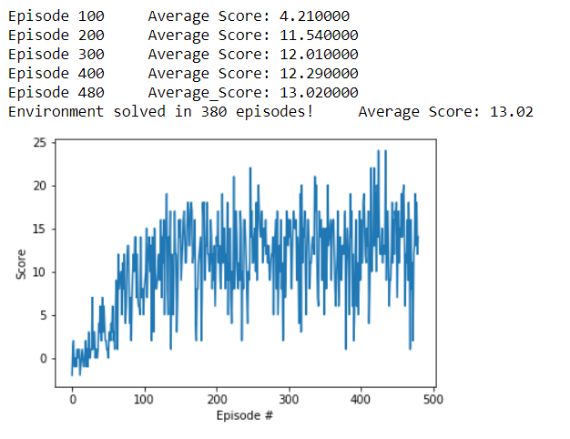

# Project Report
## Model architecture
The architecture is based in the one described in the [provided paper](https://storage.googleapis.com/deepmind-media/dqn/DQNNaturePaper.pdf).

We use an architecture in which there is a separate output unit for each possible action, an donly the state is an input to the neural network. The main advantage of this type of architecture is the ability to compute Q-values for all possible actions in a given state with only a single forward pass through the network.

The neural network architecture consists in an two fully connected hidden layers with a ReLU activation function and a fully connected linear output layer:

* Fully connected layer - input: 37 (state size) output: 64 activation : Relu
* Fully connected layer - input: 64 output: 64 activation : Relu
* Fully connected layer - input: 64 output: 4 (action size)

## Training details
The scores was a positive reward of 1 if the agent takes a yellow banana, if the agent takes a blue banana it obtains a reward of -1.

The algorithm has a batche size of 64. The behaviour policy during training was epsilon-greedy from 1 to 0.1 with a decay of 0.995 over each episode with a minimum of 0.1 and a discount rate of 0.99.

In the training we use Adam like optimizer algorithm, a learning rate of 0.001 and a Mean Sequare Error (MSE) to regularize losses.

The target model update will be done every 4 steps, each episode has 1000 steps with a maximum of 2000 episodes.

## Results
The execution of the agent within this environment was resolved in a surprisingly 380 episodes as you can see in the image below, but this is a hardly repeteable result because it depens on the initial conditions and the randomly choosen actions.

## Ideas for future work
* Extensive hyperparameter optimization
* Double Deep Q Networks
* Prioritized Experience Replay
* Dueling Deep Q Networks
